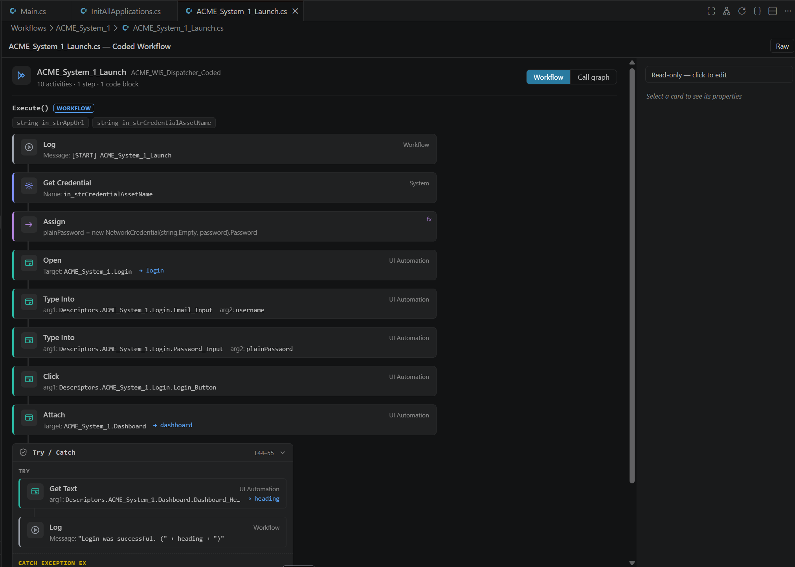

# UiPath Artifact Designer

*A community extension — not an official UiPath product. Adds visual editing
for six UiPath artifact file types — `agent.json`, `*.flow`, `*.bpmn`,
`caseplan.json`, `action-schema.json`, and `*.cs` (Coded Workflow Canvas) —
directly inside VS Code, Cursor,
and other VS Code-based IDEs, without needing to deploy and switch to UiPath Studio Web.*

Open and edit UiPath artifacts as visual designers in VS Code — the way they
look in UiPath Studio Web, without leaving your editor.

## Supported artifacts

Each file type opens in its own designer automatically, as its default editor —
except coded workflows (`*.cs`), which open in the canvas on demand (see below).

| Artifact | File | Designer |
|----------|------|----------|
| **Low-code agent** | `agent.json` | Studio-Web-style node graph — the agent at the center with its tools, contexts, escalations, and memory; editable inspector. |
| **Maestro Flow** | `*.flow` | Node-graph canvas with auto-layout (stored coordinates honored), node drag, and a per-node-type inspector. |
| **Maestro BPMN** | `*.bpmn` | Full BPMN 2.0 modeler (`bpmn-js`); UiPath `uipath:*` extension XML round-trips losslessly on save. |
| **Maestro Case** | `caseplan.json` | Stage-graph canvas (v19 & v20 schemas) with stage, edge, entry / exit condition, and SLA editing. |
| **Coded App** | `action-schema.json` | Form editor for the inputs / outputs / inOuts / outcomes data contract, with a read-only deployment-status panel. |
| **Coded Workflow Canvas** | `*.cs` | Structural activity-graph view of a UiPath coded workflow. Double-click a resolved **Invoke Workflow** card or a helper-call chip to jump to the target; REFramework state machines render as a states overview with transition chips, and a separate **Show Call Graph** view traces inter-workflow calls across the project. Not the default editor for `.cs` — open it from the editor-title **UiPath: Open Designer** button, via **Open With… → UiPath Coded Workflow Canvas**, or automatically with the `…codedWorkflow.autoOpenDesigner` setting (off by default). Read-only by default; editing is opt-in per-file via the inspector toggle, covering L0 value, L1 argument add/remove/method-switch, and L2 statement add/delete/reorder — all gated by a parse check that rejects edits introducing C# syntax errors. |

*Maestro is UiPath's low-code agentic orchestration platform — flows, BPMN processes,
and case management.*

## Screenshots

### Low-code agent (`agent.json`)

*Studio-Web-style node graph for an HR Helpdesk agent — `ManagerApproval`
escalation above the agent; `HRPolicyKnowledge` context, `GetEmployeeRecord`
tool, and the agent-memory node below. The inspector edits the model,
prompts, and input arguments.*

### Maestro Flow (`*.flow`)

*Manual trigger → action → decision → end nodes, with `dagre` auto-layout
and per-node-type styling.*

### Maestro BPMN (`*.bpmn`)

*Full BPMN 2.0 modeler embedding `bpmn-js`, with the native palette and
context pad. UiPath `uipath:*` extension XML round-trips losslessly on save.*

### Maestro Case (`caseplan.json`)

*Stage-graph canvas (v20 schema) with the case trigger, required `Intake`
and `Review` stages, and a `Dispute Handling` exception lane. SLA rules and
exit conditions edited in the inspector.*

### Coded App (`action-schema.json`)

*Form editor for the inputs / outputs / inOuts / outcomes data contract,
with a read-only `.uipath/app.config.json` deployment-status panel at the
top.*

### Coded Workflow Canvas (`*.cs`)

*Coded workflow as an activity
graph — UI Automation, System, and Workflow activities as titled cards with
navigable selector targets (`→ login`, `→ dashboard`) and a `Try / Catch`
container. The **Workflow / Call graph** toggle switches views; the inspector is
read-only until you click to edit.*

## Requirements

VS Code. Also compatible with Cursor and other VS Code based compatible editors that support standard `.vsix` extensions.

## Installation

**VS Code** — install from the
[Visual Studio Marketplace](https://marketplace.visualstudio.com/items?itemName=marcelocruzrpa.uipath-artifact-designer),
or run `ext install marcelocruzrpa.uipath-artifact-designer` from the Command
Palette.

**Cursor, VSCodium, Windsurf, and other Open VSX-backed editors** — install
from [Open VSX](https://open-vsx.org/extension/marcelocruzrpa/uipath-artifact-designer),
the registry these editors use by default.

**Manual `.vsix`** — download the latest `.vsix` from the
[Releases page](https://github.com/marcelocruzrpa/uipath-artifact-designer/releases),
then in your editor open the Command Palette and run
**Extensions: Install from VSIX…** and pick the file.

To build your own `.vsix` from source, see [CONTRIBUTING.md](CONTRIBUTING.md).

## Using a designer

1. Open a folder containing a UiPath project (so the designer can resolve
   sibling files like `entry-points.json` and resource definitions).
2. Open a supported file (`agent.json`, `*.flow`, `*.bpmn`, `caseplan.json`, or
   `action-schema.json`) — its designer opens automatically.
3. Select a node and edit its properties in the inspector. Save with **Ctrl+S**.

Edits are written straight back to the source file — it goes dirty on change,
and undo / redo work normally. Each designer reloads live when its file or a
sibling file changes on disk, and surfaces validation issues (missing files,
unrecognized resources) in a strip at the top.

**Navigating** — zoom with the toolbar **+ / −** or the `+` / `−` keys; press
`0` or **Fit** to frame the whole diagram. In the Coded Workflow Canvas,
double-click a resolved **Invoke Workflow** card to open the called workflow in
its own tab, or a helper-call chip to reveal and focus that helper's section.

**Coded workflows (`*.cs`)** — unlike the other artifacts, `.cs` files keep the
plain text editor by default. Open one in the canvas from the editor-title
**UiPath: Open Designer** button (shown on coded-workflow files), or via
**Open With… → UiPath Coded Workflow Canvas**. To have UiPath coded-workflow
files open in the canvas automatically, enable
`uipathArtifactDesigner.codedWorkflow.autoOpenDesigner` in settings — only files
that look like a coded workflow are affected, so plain C# files still open as
text. The canvas is read-only until you turn on editing for that file from the
inspector; **Reopen Artifact as Text** switches back to source (and keeps that
file from being auto-opened again for the session).

**Plain text** — click **Raw** in the toolbar, or use **Reopen as Text** /
**Open With…**. To always use the plain editor for a file type, add e.g.
`"workbench.editorAssociations": { "*.flow": "default" }` to your settings.

## Known limitations

- The condition / SLA editors in the Case designer snapshot their working copy
  when the inspector opens. If a sibling file is edited externally while the
  inspector is open, the displayed values may diverge from disk until you
  re-select the stage. The inspector rebuilds on selection change, so this is
  usually only visible in long-lived overview views.
- BPMN files larger than 2 MB are rejected by the validator before writing to
  disk — real-world BPMN files are typically well under 500 KB; the cap
  protects the extension host from pathological inputs.

## Changelog

See [CHANGELOG.md](CHANGELOG.md) for the release history.

## Contributing

Bug reports, feature requests, and pull requests are welcome. See
[CONTRIBUTING.md](CONTRIBUTING.md) for build instructions, an architecture
overview, and the contribution workflow.

## License

[MIT](LICENSE)
