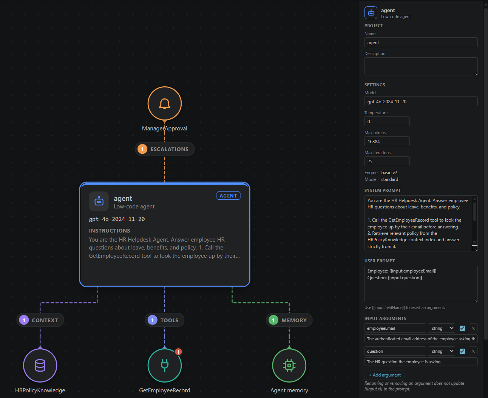
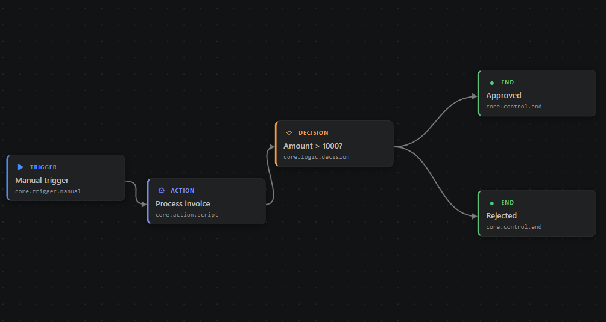
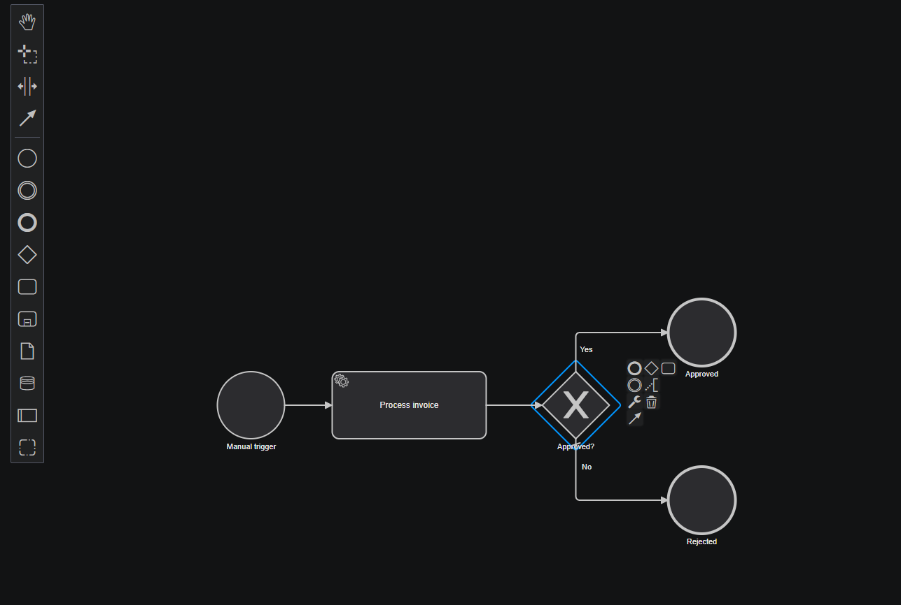
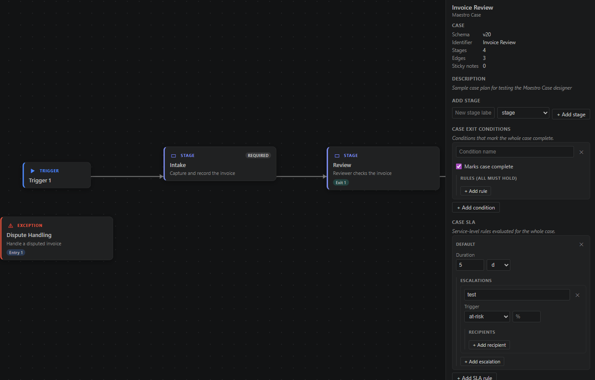
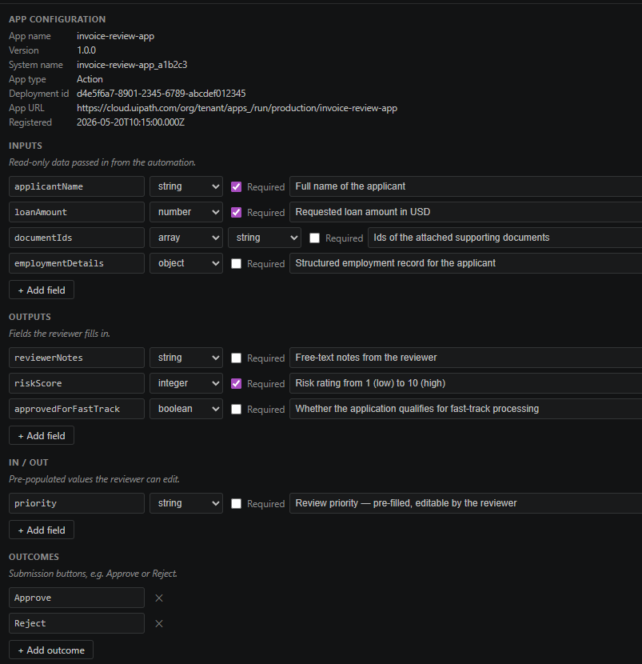

# UiPath Artifact Designer

*A community extension — not an official UiPath product. Adds visual editing
for five UiPath artifact file types — `agent.json`, `*.flow`, `*.bpmn`,
`caseplan.json`, and `action-schema.json` — directly inside VS Code, Cursor,
and other VS Code-based IDEs, without switching to UiPath Studio Web.*

<!-- Badges (uncomment once the repo + Marketplace listing are live):

-->

Open and edit UiPath artifacts as visual designers in VS Code — the way they
look in UiPath Studio Web, without leaving your editor.

## Supported artifacts

Each file type opens in its own designer automatically, as its default editor.

| Artifact | File | Designer |
|----------|------|----------|
| **Low-code agent** | `agent.json` | Studio-Web-style node graph — the agent at the center with its tools, contexts, escalations, and memory; editable inspector. |
| **Maestro Flow** | `*.flow` | Node-graph canvas with auto-layout (stored coordinates honored), node drag, and a per-node-type inspector. |
| **Maestro BPMN** | `*.bpmn` | Full BPMN 2.0 modeler (`bpmn-js`); UiPath `uipath:*` extension XML round-trips losslessly on save. |
| **Maestro Case** | `caseplan.json` | Stage-graph canvas (v19 & v20 schemas) with stage, edge, entry / exit condition, and SLA editing. |
| **Coded App** | `action-schema.json` | Form editor for the inputs / outputs / inOuts / outcomes data contract, with a read-only deployment-status panel. |

*Maestro is UiPath's low-code agentic orchestration platform — flows, BPMN processes,
and case management.*

## Screenshots

### Low-code agent (`agent.json`)

*Studio-Web-style node graph for an HR Helpdesk agent — `ManagerApproval`
escalation above the agent; `HRPolicyKnowledge` context, `GetEmployeeRecord`
tool, and the agent-memory node below. The inspector edits the model,
prompts, and input arguments.*

### Maestro Flow (`*.flow`)

*Manual trigger → action → decision → end nodes, with `dagre` auto-layout
and per-node-type styling.*

### Maestro BPMN (`*.bpmn`)

*Full BPMN 2.0 modeler embedding `bpmn-js`, with the native palette and
context pad. UiPath `uipath:*` extension XML round-trips losslessly on save.*

### Maestro Case (`caseplan.json`)

*Stage-graph canvas (v20 schema) with the case trigger, required `Intake`
and `Review` stages, and a `Dispute Handling` exception lane. SLA rules and
exit conditions edited in the inspector.*

### Coded App (`action-schema.json`)

*Form editor for the inputs / outputs / inOuts / outcomes data contract,
with a read-only `.uipath/app.config.json` deployment-status panel at the
top.*

## Requirements

VS Code. Also compatible with Cursor and other VS Code based compatible editors that support standard `.vsix` extensions.

## Installation

The extension is not yet on the VS Code Marketplace.

To try it today, download a `.vsix` from the project's Releases page once
available, then in VS Code open the Command Palette and run
**Extensions: Install from VSIX…** and pick the file.

To build your own `.vsix` from source, see [CONTRIBUTING.md](CONTRIBUTING.md).

## Using a designer

1. Open a folder containing a UiPath project (so the designer can resolve
   sibling files like `entry-points.json` and resource definitions).
2. Open a supported file (`agent.json`, `*.flow`, `*.bpmn`, `caseplan.json`, or
   `action-schema.json`) — its designer opens automatically.
3. Select a node and edit its properties in the inspector. Save with **Ctrl+S**.

Edits are written straight back to the source file — it goes dirty on change,
and undo / redo work normally. Each designer reloads live when its file or a
sibling file changes on disk, and surfaces validation issues (missing files,
unrecognized resources) in a strip at the top.

**Navigating** — zoom with the toolbar **+ / −** or the `+` / `−` keys; press
`0` or **Fit** to frame the whole diagram.

**Plain text** — click **Raw** in the toolbar, or use **Reopen as Text** /
**Open With…**. To always use the plain editor for a file type, add e.g.
`"workbench.editorAssociations": { "*.flow": "default" }` to your settings.

## Known limitations

- The condition / SLA editors in the Case designer snapshot their working copy
  when the inspector opens. If a sibling file is edited externally while the
  inspector is open, the displayed values may diverge from disk until you
  re-select the stage. The inspector rebuilds on selection change, so this is
  usually only visible in long-lived overview views.
- BPMN files larger than 2 MB are rejected by the validator before writing to
  disk — real-world BPMN files are typically well under 500 KB; the cap
  protects the extension host from pathological inputs.
- The Marketplace listing does not yet include screenshots or an icon — these
  are tracked for the first post-1.0 update.

## Changelog

See [CHANGELOG.md](CHANGELOG.md) for the release history.

## Contributing

Bug reports, feature requests, and pull requests are welcome. See
[CONTRIBUTING.md](CONTRIBUTING.md) for build instructions, an architecture
overview, and the contribution workflow.

## License

[MIT](LICENSE)
